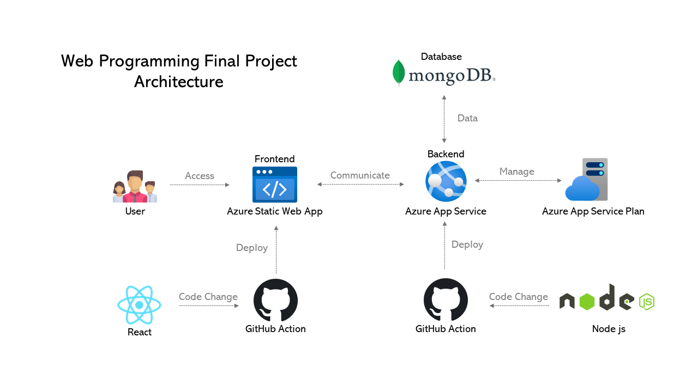

# Ultimate visualizer

[](https://github.com/yuchia0221/Ultimate-Visualizer/actions/workflows/azure-backend.yml)
[](https://github.com/yuchia0221/Ultimate-Visualizer/actions/workflows/azure-frontend.yml)

## Table of Contents

-   [Overview](#overview)
-   [Getting Started](#getting-started)
    -   [Run Node Server](#run-node-server)
    -   [Run Client Server](#run-client-server)
-   [Additional Note](#additional-note)
    -   [Package](#package)
-   [Roadmap](#roadmap)
    -   [Frontend](#frontend)
    -   [Backend](#backend)
-   [Acknowledge](#acknowledge)

## Overview



## Getting Started

To get a local copy up and running follow these simple steps.

### Prerequisites

1. Install [Node.js](https://nodejs.org/en/download/).
2. Install [npm](https://www.npmjs.com/get-npm).
3. Install depenencies for frontend and backend respectively.

    For frontend:

    ```bash
        cd frontend && npm install
    ```

    For backend:

    ```bash
        cd backend && npm install
    ```

### Run Node Server

1. Change into the repo directory: `cd Ultimate_visualizer`
2. Run the node server (will start on port 5000 by default):
    ```bash
        npm run server
    ```

### Run Client Server

1. Change into the repo directory: `cd Ultimate_visualizer`
2. Run the node server (will start on port 3000 by default):
    ```bash
        npm start
    ```

## Additional Note

### Package

-   Frontend:

    1.  React
    2.  react-router-dom
    3.  react-particles-js
    4.  iconify
    5.  sass
    6.  material-ui
    7.  axios
    8.  email-validator
    9.  js-cookie
    10. history

-   Backend:
    1. express
    2. dotenv
    3. dotenv-defaults
    4. connect-flash
    5. cookie-parser
    6. express-session
    7. cors
    8. mongoose
    9. nodemailer
    10. passport
    11. passport-local
    12. nodemon

## Roadmap

### Frontend

-   [x] UI Layout disign
-   [x] Sorting visualization
-   [x] Data structure's visualization
    -   [x] Stack
    -   [x] Queue
    -   [x] BST
    -   [x] Min Heap
    -   [x] Max Heap
    -   [x] AVL tree
    -   [x] Trie
    -   [x] Red black tree
-   [x] sign-up / sign-in page
-   [x] Email subscription
-   [x] API call -> Axios
    -   [x] sign-up / sign-in && cookie setting && user authentication && url restriction
    -   [x] Email subscription management
-   [x] cookie setting && user authentication && url restriction

### Backend

-   [x] Server
    -   [x] routing
    -   [x] Email subscription
-   [x] Model
    -   [x] mongoose model
-   [x] Service
    -   [x] User sign-up / sign-in authentication
    -   [x] Email subscription management
-   [x] Deploy
    -   [x] Hoist our websitee to the moon! (Azure App Service & Azure Static Web App)
    -   [x] Set up CI/CD pipelines on Github Actions

## Acknowledge

Project Authors are [Yu-Chia Chen](https://github.com/yuchia0221), [Jia-Jie Lin](https://github.com/JJLIN1024), and [Yu-Hsuan Hu](https://github.com/hu0810)
